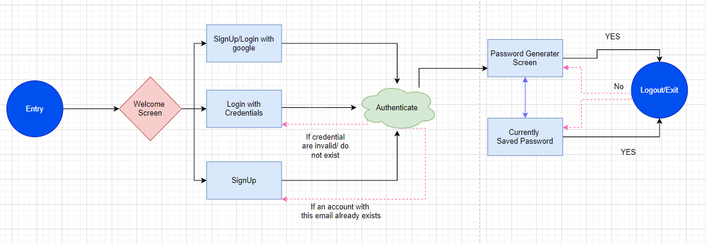

# Password Manager

Flutter application for saving and generating the random password.

## User Flow Diagram and Description

## Use Cases and description

 
### Description:  ####
A Flutter app made using firebase which stores all your passwords and allows you to generate a random password.

### Use Cases:
#### 1. User should be able to sign in/sign up with his google account using firebase 
#### 2. User should be able to sign in/sign up using a local account.
#### 3. User should be already have a sample password generated for him.
#### 4. User should be able to toggle the lenght of his password and the character,symbols he wants to use.
#### 5. User should be able to copy his password to clipboard
#### 6. User should be able to store his passwords with their username in the app
#### 7. User should be able to search his passwords.
#### 8. User should be able to exit his app.

## Video defining the use cases one by one

